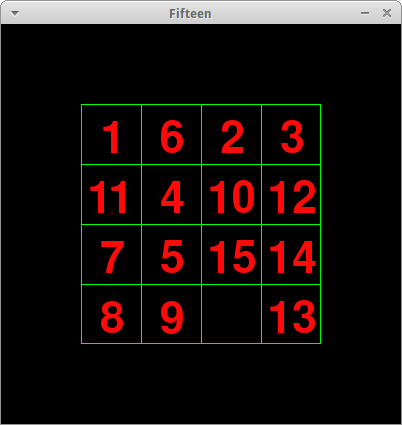

Fifteen
=======

Fifteen is a simple puzzle game written in Python with PyGame using TDD methodology (Test-Driven Development).

To run the game you need [pygame](http://pygame.org) installed on your system.
To install dependencies on Ubuntu: `sudo apt-get install python-pygame`  
To actually run the game: `python play_fifteen.py`

Screenshot:

